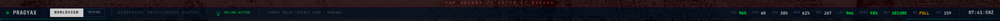
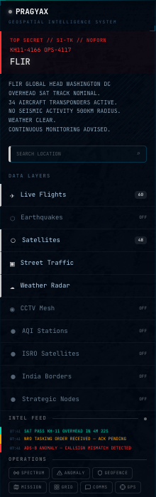
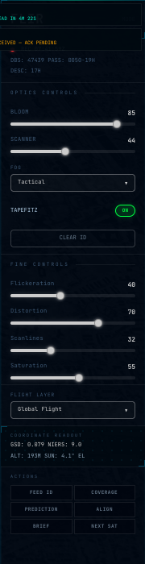
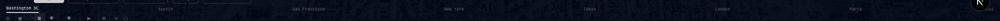

# PRAGYAX — OPERATIONAL FEATURE MANUAL

> CLASSIFICATION: TOP SECRET // SI-TK // NOFORN
> DOCUMENT TYPE: OPERATOR FIELD GUIDE
> REVISION: 4.3.0

---

## TABLE OF CONTENTS

| # | Feature | Section |
|---|---------|---------|
| 1 | [Console Layout](#1-console-layout) | UI structure |
| 2 | [Boot Sequence](#2-boot-sequence) | Startup |
| 3 | [TopHUD Metrics Bar](#3-tophud-metrics-bar) | Status display |
| 4 | [Left Panel — Command & Control](#4-left-panel--command--control) | Primary ops |
| 5 | [Right Panel — Optics & Filters](#5-right-panel--optics--filters) | Visual tuning |
| 6 | [Bottom Navigation](#6-bottom-navigation) | Mode select + cities |
| 7 | [Visual Rendering Modes](#7-visual-rendering-modes) | 7 mode system |
| 8 | [Mode Transition Cinematics](#8-mode-transition-cinematics) | Transition FX |
| 9 | [Reticle Overlay System](#9-reticle-overlay-system) | HUD reticles |
| 10 | [Data Layers](#10-data-layers) | 13 layers |
| 11 | [EM Spectrum Analyzer](#11-em-spectrum-analyzer) | SIGINT |
| 12 | [Anomaly Detection Engine](#12-anomaly-detection-engine) | Auto-detect |
| 13 | [Geofence Engine](#13-geofence-engine) | Perimeter ops |
| 14 | [Mission Planner](#14-mission-planner) | Route planning |
| 15 | [Surveillance Grid](#15-surveillance-grid) | Multi-cam |
| 16 | [Secure Message Console](#16-secure-message-console) | COMMS |
| 17 | [GPS Realtime Location](#17-gps-realtime-location) | Geolocation |
| 18 | [Timeline Scrubber](#18-timeline-scrubber) | Temporal nav |
| 19 | [Maritime Vessel Tracking](#19-maritime-vessel-tracking) | AIS domain |
| 20 | [Cross-Domain Correlation](#20-cross-domain-correlation) | Intel fusion |
| 21 | [Satellite Ground Track](#21-satellite-ground-track) | Orbital paths |
| 22 | [Day/Night Terminator](#22-daynight-terminator) | Solar overlay |
| 23 | [Chart Widgets](#23-chart-widgets) | Data viz |
| 24 | [Animated Metrics](#24-animated-metrics) | Number FX |
| 25 | [Glassmorphic Panel System](#25-glassmorphic-panel-system) | Panel styling |
| 26 | [Voice Readout Engine](#26-voice-readout-engine) | Audio intel |
| 27 | [AI Command Console](#27-ai-command-console) | ARGUS |
| 28 | [Chanakya Mode](#28-chanakya-mode) | India theatre |
| 29 | [Keyboard Shortcuts](#29-keyboard-shortcuts) | Quick access |
| 30 | [Audio Engine](#30-audio-engine) | Spatial SFX |

---

## 1. Console Layout

```
┌──────────────────────────────────────────────────────────────────┐
│                         TopHUD (38px)                             │
├──────────┬─────────────────────────────────────────┬─────────────┤
│          │                                         │             │
│  LEFT    │            CesiumJS 3D Globe            │    RIGHT    │
│  PANEL   │         (full viewport, z-0)            │    PANEL    │
│  220px   │                                         │    180px    │
│          │   ┌───────────────────────────┐         │             │
│  Intel   │   │   Exclusive Panels        │         │  Optics     │
│  Layers  │   │   (Spectrum / Anomaly /   │         │  Scanner    │
│  Feed    │   │    Geofence / Mission /   │         │  FPA        │
│  Ops     │   │    Grid / Comms)          │         │  Distortion │
│  Status  │   └───────────────────────────┘         │  Scanlines  │
│  Summary │                                         │  Saturation │
│  Coords  │                          ┌─────────┐   │  Flight Src │
│          │                          │MiniGlobe│   │  Sat Data   │
├──────────┴──────────────────────────┴─────────┴───┴─────────────┤
│                      Timeline Scrubber                           │
├──────────────────────────────────────────────────────────────────┤
│  Landmarks │ City Quick-Nav │ Visual Mode Selector │ Controls    │
└──────────────────────────────────────────────────────────────────┘
```

---

## 2. Boot Sequence

**Location:** Full-screen overlay on app load.

**What it does:** Classified system boot simulation — biometric scan, radar scope animation, terminal log output, subsystem checks. The CesiumJS globe loads behind it.

**How to use:** Refresh the page. Plays automatically. Wait ~10 seconds for completion.

```
File: src/components/layout/BootSequence.tsx
```

---

## 3. TopHUD Metrics Bar

**Location:** Fixed 38px bar across the top of the screen. Always visible.



**What it displays (left to right):**
- PRAGYAX logo with system pulse
- WORLDVIEW / Chanakya mode tabs
- "GEOSPATIAL INTELLIGENCE SYSTEM" label
- Uplink status indicator (green = active)
- Network delay/latency readout
- Classification banner (center): `TOP SECRET // SI-TK // NOFORN`
- Animated metrics: SIG%, FPS, CPU%, MEM%, signal count, FPS rate, POLL count
- SECURE status indicator
- UTC clock (HH:MM:SS)

**How to use:** Read-only status display. Metrics animate with easeOutQuart interpolation. Values flash cyan when they change by >10%.

```
Files: src/components/layout/TopHUD.tsx
       src/hooks/useAnimatedNumber.ts
```

---

## 4. Left Panel — Command & Control

**Location:** Fixed 220px sidebar on the left, between TopHUD and BottomNav.



**Sections (top to bottom):**

| Section | What it shows |
|---------|---------------|
| **PRAGYAX Header** | Logo, classification, MGRS grid ref, current mode name |
| **Intel Brief** | AI-generated situation report for current viewport |
| **Search** | Location search bar |
| **Data Layers** | 13 toggle switches for all intelligence layers |
| **Intel Feed** | Real-time scrolling event log — satellite passes, anomaly alerts, intel intercepts |
| **Operations** | 7 operation buttons (see below) |
| **System Status** | 10 subsystem health dots + uplink/signal/latency/encryption readouts |
| **Intel Summary** | Active feeds, anomalies, vessels, geofences, last update |
| **Coordinates** | Current map center lat/lon + MGRS |

**Operations Buttons:**

| Button | Action |
|--------|--------|
| `SPECTRUM` | Opens EM Spectrum Analyzer panel |
| `ANOMALY (n)` | Opens Anomaly Panel. Badge shows unacknowledged count |
| `GEOFENCE (n)` | Opens Geofence Panel. Badge shows armed count |
| `MISSION` | Opens Mission Planner panel |
| `GRID` | Opens Surveillance Grid |
| `COMMS` | Opens Secure Message Console |
| `GPS` | Toggles realtime GPS tracking. Highlights when active |

**How to use:** Scroll down to see all sections. Click any operation button to open its exclusive panel (only one can be open at a time). Toggle data layers on/off with the switches.

```
File: src/components/layout/LeftPanel.tsx
```

---

## 5. Right Panel — Optics & Filters

**Location:** Fixed 180px sidebar on the right.



**Controls:**
- **REC** indicator with timestamp
- **Optics Controls:** Bloom, Scanner, FPA (focal plane), Distortion, Scanlines, Saturation sliders
- **Flight Layer Source:** Global / India / Military dropdown
- **Satellite Source:** SpaceTrack, Celestrak, ISRO, Starlink, Debris
- **Buttons:** Feed ID, Crosshair, Prediction, Align, Reset, Next SAT

**How to use:** Drag sliders to adjust visual filter intensity in real-time. These affect the VisualModeFilter CSS post-processing layers.

```
File: src/components/layout/RightPanel.tsx
```

---

## 6. Bottom Navigation

**Location:** Fixed 56px bar at the bottom.



**Contents:**
- **City quick-nav:** Click city names (Washington DC, Austin, San Francisco, New York, Tokyo, London, Paris) to fly the camera there
- **Landmark buttons:** US Capitol, Washington Monument, Lincoln Memorial, Pentagon, Jefferson Memorial
- **Visual mode selector:** 6 mode buttons + playback controls
- **Globe controls:** Auto-rotate, zoom buttons

**How to use:** Click any city or landmark to fly camera to that location. Click mode buttons or press `1-6` keys to switch visual modes.

```
File: src/components/layout/BottomNav.tsx
```

---

## 7. Visual Rendering Modes

7 distinct visual rendering filters applied via 8-layer CSS post-processing:

| Key | Mode | Visual Effect | Accent |
|-----|------|---------------|--------|
| `1` | **NORMAL** | Clean, high-contrast dark | Cyan `#00FFD1` |
| `2` | **CRT** | Retro scan lines, warm bloom, flicker | Orange `#FFA500` |
| `3` | **NVG** | Green phosphor, image intensifier grain, night glow | Green `#00FF41` |
| `4` | **FLIR** | Grayscale infrared thermal palette | Gray `#CCCCCC` |
| `5` | **GREEN** | Matrix-style phosphor terminal | Lime `#39FF14` |
| `6` | **DRONE** | UAV stabilized HUD, mil-dot reticle | Cyan `#00FFD1` |
| `C` | **CHANAKYA** | Warm saffron, India strategic theatre | Orange `#FF9933` |

**How to use:** Press number keys `1`-`6` or click mode buttons in bottom nav. Press `C` for Chanakya. Each mode changes: color palette, reticle shape, panel accents, post-processing filters, transition animation.

**8 filter layers** (VisualModeFilter.tsx): base tint, scanlines, vignette, noise/grain, color curve, bloom/glow, chromatic aberration, lens distortion.

```
Files: src/components/map/VisualModeFilter.tsx
       src/constants/modes.ts
       src/stores/modeStore.ts
```

---

## 8. Mode Transition Cinematics

**Location:** Full-screen overlay, plays for 600ms when switching modes.

**Animations per mode:**
| Transition | Effect |
|------------|--------|
| Static Burst | White noise flash (default) |
| NVG Flash | Green flash + fade |
| Thermal Wipe | Horizontal heat wipe |
| Drone Shake | Camera shake simulation |
| Matrix Rain | Digital rain overlay |
| Saffron Burst | Orange patriotic flash |

**How to trigger:** Switch any visual mode. The transition plays automatically. The mode label appears center-screen with an expanding underline.

```
Files: src/components/ui/ModeTransition.tsx
       src/app/globals.css (mode-transition-* classes)
```

---

## 9. Reticle Overlay System

**Location:** Center of viewport, visible only in tactical modes (NVG/FLIR/DRONE/CRT/GREEN/CHANAKYA).

**Reticle per mode:**
| Mode | Reticle Shape |
|------|---------------|
| NVG | Circle + crosshair |
| FLIR | Bracket box (thermal targeting) |
| DRONE | Mil-dot rangefinder |
| CRT | Thin crosshair |
| GREEN | Diamond brackets |
| CHANAKYA | Lotus / Ashoka Chakra pattern |

**Components:** Outer rotating ring with tick marks (60s rotation), inner mode-specific SVG, coordinate readout below center.

**How to use:** Automatic — appears when you switch to any tactical mode. The reticle breathes (scale pulse) and the outer ring rotates continuously.

```
File: src/components/ui/ReticleOverlay.tsx
```

---

## 10. Data Layers

13 toggleable intelligence layers rendered on the CesiumJS globe.

| Layer | Description | Toggle |
|-------|-------------|--------|
| **Live Flights** | ADS-B aircraft positions from OpenSky Network. Click aircraft for EntityDetail panel with callsign, altitude, speed, heading. Camera follow on click. | Left panel switch or `F` key |
| **Earthquakes** | USGS seismic events. Pulsing circles scaled by magnitude. Click for depth/magnitude/location. | Left panel switch or `E` key |
| **Satellites** | Celestrak TLE data propagated via SGP4. Orbital paths, click for profile. | Left panel switch or `S` key |
| **Street Traffic** | Google Traffic tile overlay showing congestion. | Left panel switch |
| **Weather Radar** | Weather tile imagery overlay. | Left panel switch |
| **CCTV Mesh** | Surveillance camera positions. Click for AI-powered frame analysis. | Left panel switch |
| **AQI Stations** | India CPCB air quality monitoring stations. | Left panel switch |
| **ISRO Satellites** | India-specific satellite constellation. | Left panel switch |
| **India Borders** | LOC/LAC/international boundary GeoJSON. | Left panel switch |
| **Strategic Nodes** | Military/strategic installations. | Left panel switch |
| **Graticule** | Lat/lon grid lines. | Left panel switch |
| **Day/Night Terminator** | Solar-computed day/night boundary with city lights. | Automatic |
| **Satellite Ground Track** | Orbital path prediction for selected satellite. | Automatic on satellite select |

```
Directory: src/components/layers/ (13 files)
Store: src/stores/layerStore.ts
```

---

## 11. EM Spectrum Analyzer

**Location:** Exclusive panel, opens over globe area.

**What it does:** Real-time canvas-rendered RF spectrum visualization from 0.1 MHz to 40 GHz. Shows 39 known signal bands including GPS L1 (1575 MHz), ADS-B (1090 MHz), Thuraya satellite, X-band radar, WiFi 2.4/5 GHz, military UHF/VHF, and satellite downlinks.

**Features:**
- Animated waveform with noise floor
- Hover for frequency/power readout
- Pan through frequency range
- Signal classification: CIVILIAN / MILITARY / SATELLITE / UNKNOWN
- Power measured in dBm

**How to use:**
1. Click `SPECTRUM` in the Operations section of the left panel
2. The spectrum display opens with real-time animated signals
3. Hover over peaks to identify signal bands
4. Pan left/right to scroll through frequencies
5. Click `SPECTRUM` again or open another panel to close

```
Files: src/components/panels/SpectrumAnalyzer.tsx
       src/lib/spectrumSimulator.ts
```

---

## 12. Anomaly Detection Engine

**Location:** Exclusive panel + background engine.

**What it does:** Autonomous anomaly detection running continuously in the background. Monitors all data streams and flags statistical outliers:

| Detection Type | What it Catches |
|----------------|-----------------|
| ADS-B Anomaly | Emergency squawk codes (7500/7600/7700), altitude deviations, callsign mismatches |
| Seismic Swarm | Spatial clustering of earthquakes within short time windows |
| Cross-Domain | Correlations between anomalies across flight/seismic/maritime domains |

**Severity levels:** LOW (blue) / MEDIUM (yellow) / HIGH (orange) / CRITICAL (red)

**How to use:**
1. Click `ANOMALY` in Operations. Badge shows unacknowledged count: `ANOMALY (3)`
2. Panel lists all detected anomalies with severity, description, confidence score, timestamp
3. Click an anomaly to acknowledge it (removes from badge count)
4. Anomalies also appear in the Intel Feed on the left panel

```
Files: src/components/panels/AnomalyPanel.tsx
       src/hooks/useAnomalyEngine.ts
       src/lib/correlation/engine.ts
```

---

## 13. Geofence Engine

**Location:** Exclusive panel + 1Hz background evaluation loop.

**What it does:** Draw geographic perimeters on the globe and monitor for entity breaches.

**Capabilities:**
- Create polygon geofences by clicking vertex points on the globe
- Arm/disarm individual fences
- 1Hz evaluation loop checks ALL tracked entities against ALL armed fences
- Ray-casting point-in-polygon algorithm for accurate boundary detection
- Breach alerts fire to Intel Feed + AlertToast

**How to use:**
1. Click `GEOFENCE` in Operations. Badge shows armed count: `GEOFENCE (2)`
2. Use panel controls to create new fences or manage existing ones
3. Click map points to define vertices
4. Arm the fence to start monitoring
5. Any aircraft/vessel/entity crossing the boundary triggers a breach alert

```
Files: src/components/panels/GeofencePanel.tsx
       src/hooks/useGeofenceEngine.ts
       src/lib/geo.ts
```

---

## 14. Mission Planner

**Location:** Exclusive panel.

**What it does:** Plan multi-waypoint missions with route visualization on the globe.

**Features:**
- Add waypoints with coordinates, altitude, speed
- Visual route polyline on globe
- Mission timing calculations
- Export mission plan

**How to use:**
1. Click `MISSION` in Operations
2. Add waypoints using the panel controls
3. Route renders on the globe as you add points

```
File: src/components/panels/MissionPlanner.tsx
```

---

## 15. Surveillance Grid

**Location:** Exclusive panel.

**What it does:** Multi-camera CCTV surveillance grid with AI detection overlays. Displays YouTube live camera feeds in a tiled view with per-camera status indicators.

**How to use:**
1. Click `GRID` in Operations
2. Grid shows multiple live camera feeds simultaneously
3. Camera status: online (green) / offline (red)
4. Click individual camera to expand

```
Files: src/components/panels/SurveillanceGrid.tsx
       src/components/panels/CCTVPanel.tsx
       src/constants/cameras.ts
```

---

## 16. Secure Message Console

**Location:** Exclusive panel.

**What it does:** Military-style encrypted messaging terminal with classification markings.

**Features:**
- 4 channels: FLASH / PRIORITY / ROUTINE / ADMIN
- Classification per message: TS (Top Secret) / S (Secret) / C (Confidential) / U (Unclassified)
- AI auto-generates intelligence messages from 12 templates every 15-30 seconds
- Typewriter-style text entry
- Auto-scroll with SFX alert on new messages

**How to use:**
1. Click `COMMS` in Operations
2. Messages stream in automatically from AI
3. Type in the input field at the bottom and press Enter to send
4. Switch channels using the channel selector

```
File: src/components/panels/SecureMessageConsole.tsx
```

---

## 17. GPS Realtime Location

**Location:** `GPS` button in Operations + `G` keyboard shortcut.

**What it does:** Uses browser Geolocation API to track your real-world position:
- Flies the camera to your GPS coordinates
- Places a cyan pulsing billboard marker at your position
- Draws an accuracy circle around your location
- Continuously tracks as you move
- Pushes GPS events to Intel Feed
- Shows accuracy on button: `GPS ±15m`

**How to use:**
1. Click `GPS` button in Operations, or press `G`
2. Browser asks for location permission — grant it
3. Globe flies to your position with a pulsing marker
4. Click `GPS` again or press `G` to deactivate

```
Files: src/hooks/useRealtimeLocation.ts
       src/components/layout/LeftPanel.tsx
```

---

## 18. Timeline Scrubber

**Location:** Fixed bar between the globe and bottom navigation, full width.

**What it does:** Temporal navigation allowing you to scrub through the last 24 hours of data.

**How to use:** Drag the scrubber thumb to any point in the timeline. Current playback time displays in UTC.

```
File: src/components/ui/TimelineScrubber.tsx
```

---

## 19. Maritime Vessel Tracking

**Location:** Vessel entities on globe + count in Intel Summary.

**What it does:** Simulated AIS vessel tracking across 10 major global ports. 30-second polling interval. Vessels rendered as globe entities with trail history.

**How to use:** Vessel count appears in Intel Summary: `VESSELS: 47`. Vessels are visible on the globe near coastal areas and shipping lanes.

```
Files: src/hooks/useVesselPolling.ts
       src/services/vesselService.ts
```

---

## 20. Cross-Domain Correlation

**Location:** Results appear as CORRELATION-type entries in Anomaly Panel.

**What it does:** Analyzes anomalies across intelligence domains. Clusters by spatial proximity (haversine), links flight anomalies with seismic events and maritime deviations. Runs every 30 seconds.

**How to use:** Open Anomaly Panel — look for CORRELATION type entries with CRITICAL/HIGH severity. These describe multi-domain patterns with confidence scores.

```
File: src/lib/correlation/engine.ts
```

---

## 21. Satellite Ground Track

**Location:** Renders on globe when a satellite is selected.

**What it does:** Computes orbital ground track prediction using SGP4 propagation:
- Past track (0.75 orbit): fading orange polyline
- Future track (1.5 orbit): cyan dashed polyline
- Ground footprint circle based on altitude
- Handles antimeridian crossing
- Auto-refreshes every 60 seconds

**How to use:** Click any satellite on the globe. The ground track renders automatically showing the orbital path past and future.

```
File: src/components/layers/SatelliteGroundTrack.tsx
```

---

## 22. Day/Night Terminator

**Location:** Globe overlay, always active.

**What it does:** Enables Cesium sun-based globe lighting. Renders 33 major world cities as light points on the night hemisphere. City lights are population-scaled (3-9px) with twilight brightness falloff.

**How to use:** Automatic — the globe shows day/night shading based on the current sun position. City lights glow on the dark side.

```
File: src/components/layers/DayNightTerminator.tsx
```

---

## 23. Chart Widgets

**What it does:** Three canvas-based chart components themed to the current visual mode accent color:

| Widget | Description |
|--------|-------------|
| **Sparkline** | Mini line chart with fill gradient and latest-value dot |
| **Gauge** | Circular arc gauge with animated sweep and glow |
| **RadarChart** | Multi-axis spider chart with data polygon |

All use Canvas 2D API with devicePixelRatio scaling for crisp rendering.

```
File: src/components/ui/ChartWidgets.tsx
```

---

## 24. Animated Metrics

**Location:** TopHUD metrics bar.

**What it does:** All numeric values in the TopHUD (SIG, FPS, CPU, MEM, ENT, LAT, FEED, VES, ANOM) use animated number interpolation:
- easeOutQuart easing over 300ms transition
- Flash detection: values that change by >10% flash with a cyan glow animation
- Smooth counting effect between old and new values

```
Files: src/hooks/useAnimatedNumber.ts
       src/components/layout/TopHUD.tsx
```

---

## 25. Glassmorphic Panel System

**Location:** All panels (Left, Right, Top, Bottom).

**What it does:** Three-tier glassmorphism system:

| Tier | Opacity | Blur | Used On |
|------|---------|------|---------|
| Tier 1 | 85% | 20px blur + 1.4x saturate | Left Panel, Right Panel |
| Tier 2 | 65% | 12px blur + 1.2x saturate | TopHUD, BottomNav |
| Tier 3 | 40% | 6px blur | Floating elements |

Panels have gradient-border shimmer animation along the top edge.

```
File: src/app/globals.css (panel-tier-* classes)
```

---

## 26. Voice Readout Engine

**What it does:** Web Speech API singleton with military cadence (rate 1.1, pitch 0.85). Pre-built announcements for:

| Event | Example |
|-------|---------|
| Earthquake Alert | "Seismic event detected. Magnitude 5.2..." |
| Squawk Alert | "Squawk 7700 declared. Aircraft [callsign]..." |
| Satellite Pass | "Satellite pass detected overhead..." |
| Mode Change | "Switching to [mode] mode..." |
| Geofence Breach | "Geofence breach. Entity entered zone..." |
| Anomaly | "Anomaly detected. Severity [level]..." |
| Boot Complete | "PragyaX online. All systems nominal." |

```
File: src/utils/voiceEngine.ts
```

---

## 27. AI Command Console

**Location:** Centered modal overlay.

**What it does:** Natural language command interface powered by Claude/Gemini. Type commands to control the console.

**How to use:**
1. Press `Cmd+K` or click the AI button in bottom nav
2. Type a command: "fly to Mumbai", "show me earthquakes near Tokyo", "generate intel brief"
3. Press Enter — AI interprets and executes

**Capabilities:** Camera control, layer toggling, intel generation, data queries, satellite profiles, situation analysis.

```
Files: src/components/panels/CommandModal.tsx
       src/utils/commandExecutor.ts
       src/services/claudeService.ts
```

---

## 28. Chanakya Mode

**Location:** Press `C` or click Chanakya tab in TopHUD.

**What it does:** India-focused strategic intelligence theatre that replaces all standard panels with India-specific variants:

| Component | India Specialization |
|-----------|---------------------|
| Left Panel | 8 INT disciplines: SIGINT, HUMINT, IMINT, COMINT, OSINT, CYBER, ELINT, MASINT |
| Right Panel | India defense data, strategic assessments |
| Bottom Nav | India-specific navigation |
| Mission Clock | ISRO mission countdown/stopwatch |
| Layers | India borders (LOC/LAC), strategic nodes, ISRO sats, AQI network |
| Accent | Saffron `#FF9933` throughout |

**How to use:** Press `C` to toggle. All panels swap to India-specific mode. Press `C` again to return to WORLDVIEW.

```
Directory: src/components/chanakya/ (4 files)
Hook: src/hooks/useChanakyaMode.ts
```

---

## 29. Keyboard Shortcuts

Press `?` or `/` to see the overlay.

| Key | Action |
|-----|--------|
| `1` | NORMAL mode |
| `2` | CRT mode |
| `3` | NVG mode |
| `4` | FLIR mode |
| `5` | GREEN mode |
| `6` | DRONE mode |
| `C` | Toggle Chanakya |
| `F` | Toggle flights layer |
| `S` | Toggle satellites layer |
| `E` | Toggle earthquakes layer |
| `G` | Toggle GPS location |
| `Space` | Auto-rotate globe |
| `Cmd+K` | Open AI command |
| `Esc` | Close panel/modal |
| `?` | Shortcut overlay |

```
Files: src/hooks/useKeyboardShortcuts.ts
       src/components/ui/ShortcutOverlay.tsx
```

---

## 30. Audio Engine

**What it does:** Procedural spatial audio system using Web Audio API with 25+ sound effects:

| Category | Sounds |
|----------|--------|
| System | Boot beep, click, switch, scan, blip, ping |
| Alerts | Alert, warning, critical, alarm, notification |
| Data | Transmission, radar sweep, sonar ping |
| UI | Panel open/close, mode switch, button hover |
| Intel | Intercept detected, anomaly found, breach |

Audio adapts to the current visual mode.

```
File: src/utils/audioEngine.ts
```

---

## PROJECT STRUCTURE

```
src/
├── app/                     # Next.js 16 App Router
│   ├── api/                 # 12 API routes
│   │   ├── flights/         # OpenSky ADS-B proxy
│   │   ├── satellites/      # Celestrak TLE proxy
│   │   ├── earthquakes/     # USGS GeoJSON proxy
│   │   ├── india/aqi/       # CPCB AQI proxy
│   │   ├── weather/tile/    # Weather tile proxy
│   │   ├── intel/           # AI endpoints (brief, command, breadcrumbs, satellite-profile)
│   │   ├── vision/          # Gemini CCTV analysis
│   │   ├── status/          # Status ticker
│   │   └── health/          # Health check
│   ├── page.tsx             # Root page
│   ├── layout.tsx           # Root layout
│   └── globals.css          # Global styles (mode transitions, glassmorphism, cursors, reticles)
│
├── components/
│   ├── layout/              # PragyaXShell, TopHUD, LeftPanel, RightPanel, BottomNav, BootSequence
│   ├── layers/              # 13 layers: Flight, Satellite, Earthquake, AQI, CCTV, Traffic,
│   │                        #   Weather, Graticule, IndiaBorder, StrategicNode, ISRO,
│   │                        #   SatelliteGroundTrack, DayNightTerminator
│   ├── panels/              # 12 panels: SpectrumAnalyzer, AnomalyPanel, GeofencePanel,
│   │                        #   MissionPlanner, SurveillanceGrid, SecureMessageConsole,
│   │                        #   CCTVPanel, CommandModal, DataLayers, EntityDetail, IntelBrief,
│   │                        #   LayerToggle
│   ├── ui/                  # ReticleOverlay, ModeTransition, ChartWidgets, TimelineScrubber,
│   │                        #   AlertToast, ModeButton, ShortcutOverlay, HUDMetric, SliderControl
│   ├── map/                 # CesiumViewer, MiniGlobe, ScopeOverlay, VisualModeFilter
│   ├── chanakya/            # ChanakyaLeftPanel, ChanakyaRightPanel, ChanakyaBottomNav, ISROMissionClock
│   └── data/                # DataPollingManager
│
├── hooks/                   # 17 hooks: useFlightPolling, useSatellitePolling, useEarthquakePolling,
│                            #   useAQIPolling, useVesselPolling, useAnomalyEngine, useGeofenceEngine,
│                            #   useAnimatedNumber, useRealtimeLocation, useKeyboardShortcuts,
│                            #   useEntityClick, useIntelBrief, useStatusTicker, useBreadcrumbs,
│                            #   useChanakyaMode, useDroneControls, useDroneCommentary
│
├── stores/                  # 9 Zustand stores: modeStore, dataStore, layerStore, mapStore,
│                            #   cesiumStore, aiStore, hudStore, trailStore, exclusiveStores
│
├── services/                # 8 services: flightService, satelliteService, earthquakeService,
│                            #   vesselService, weatherService, claudeService, geminiService, wsService
│
├── lib/                     # apiHelpers, cache, rateLimit, geo, gpsProjection, schemas,
│                            #   spectrumSimulator, prompts, correlation/engine
│
├── constants/               # 10 configs: modes, layers, cities, cameras, chanakya,
│                            #   cyberData, elintData, humintData, masintData, sigintData
│
├── utils/                   # audioEngine, voiceEngine, cesiumHelpers, commandExecutor
│
└── types/                   # TypeScript type definitions (index.ts)
```

---

<p align="center"><code>PRAGYAX // OPERATIONAL FEATURE MANUAL // END OF DOCUMENT</code></p>
