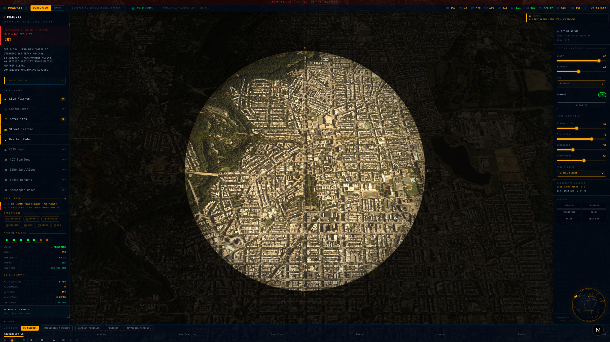
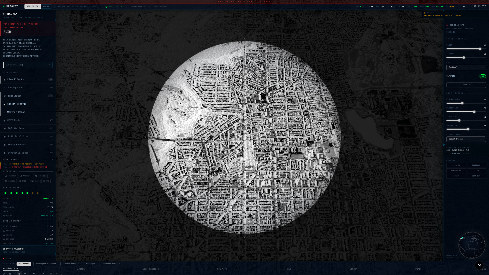

<p align="center">
  
</p>

<h1 align="center">
  <code>PRAGYAX</code>
</h1>

<p align="center">
  <code>GEOSPATIAL INTELLIGENCE CONSOLE // BUILD 4.3.0</code><br/>
  <sub>ALL-DOMAIN AWARENESS | REAL-TIME SURVEILLANCE | AI-DRIVEN INTELLIGENCE FUSION</sub>
</p>

<p align="center">
  
  
  
  
  
</p>

---

<p align="center">
  
</p>

<p align="center"><sub>FIG 1. WORLDVIEW mode — CRT visual filter active. Left panel shows data layers, intel feed, operations. Right panel shows optics controls. Globe renders real-time flight + satellite data.</sub></p>

---

## SYSTEM OVERVIEW

PragyaX is a full-stack geospatial intelligence console rendering a real-time 3D globe with live multi-domain data feeds — flights (ADS-B), satellites (TLE/SGP4), seismic events (USGS), maritime vessels (AIS), CCTV surveillance, air quality, weather, and traffic. Two operational theatres: **WORLDVIEW** (global) and **CHANAKYA** (India-centric strategic intelligence with 8 INT disciplines).

7 visual rendering modes. 13 data layers. AI-powered command interface. Procedural audio engine. Anomaly detection. Geofence enforcement. Mission planning. Spectrum analysis. Encrypted tactical messaging.

---

## QUICK START

```bash
git clone <repo> && cd worldview
cp .env.example .env.local     # Add API keys (see below)
npm install && npm run dev     # http://localhost:3000
```

### Required Environment Variables

```env
NEXT_PUBLIC_GOOGLE_MAPS_API_KEY=   # Google 3D Tiles + Traffic
NEXT_PUBLIC_CESIUM_ION_TOKEN=      # CesiumJS terrain
GEMINI_API_KEY=                    # CCTV vision analysis
ANTHROPIC_API_KEY=                 # AI command + intel briefs
```

### Build for Deployment

```bash
npm run build && npm start
```

---

<p align="center">
  
</p>

<p align="center"><sub>FIG 2. FLIR thermal rendering mode. Grayscale infrared palette with scope overlay. Classification banner, animated metrics, intel feed all adapt to active visual mode.</sub></p>

---

## OPERATIONAL MODES

| Mode | Theatre | Description |
|------|---------|-------------|
| **WORLDVIEW** | Global | All data layers, worldwide ADS-B/satellite/seismic coverage |
| **CHANAKYA** | India | Border monitoring, ISRO tracking, AQI network, strategic nodes, 8 INT ops (SIGINT/HUMINT/IMINT/COMINT/OSINT/CYBER/ELINT/MASINT) |

## VISUAL RENDERING MODES

| Key | Mode | Filter |
|-----|------|--------|
| `1` | NORMAL | Clean high-contrast |
| `2` | CRT | Retro monitor — scanlines, bloom, flicker |
| `3` | NVG | Night vision green intensifier + grain |
| `4` | FLIR | Forward-looking infrared thermal |
| `5` | GREEN | Phosphor terminal display |
| `6` | DRONE | UAV stabilization HUD |
| `C` | CHANAKYA | Saffron intelligence console |

Each mode applies: unique color palette, post-processing filters (8-layer CSS), mode-specific reticle overlay, transition cinematics, and adapted panel styling.

---

## FEATURE MATRIX

### Intelligence Layers

| Layer | Source | Refresh | Key |
|-------|--------|---------|-----|
| Live Flights | OpenSky ADS-B | 15s | `F` |
| Satellites | Celestrak TLE + SGP4 | 5m | `S` |
| Earthquakes | USGS GeoJSON | 60s | `E` |
| Maritime Vessels | AIS simulation | 30s | — |
| Weather Radar | Tile imagery | 5m | — |
| Street Traffic | Google Tiles | 60s | — |
| CCTV Mesh | Camera feeds | On-demand | — |
| Air Quality | CPCB India | 10m | — |
| ISRO Satellites | Celestrak India | 5m | — |
| India Borders | GeoJSON | Static | — |
| Strategic Nodes | Intel database | Static | — |
| Graticule Grid | Computed | Static | — |
| Day/Night Terminator | Solar position | 60s | — |

### Operations Console

| Operation | Button | Function |
|-----------|--------|----------|
| **SPECTRUM** | `SPECTRUM` | RF spectrum analyzer — 0.1 MHz to 40 GHz waterfall display |
| **ANOMALY** | `ANOMALY (n)` | Autonomous anomaly detection — ADS-B, seismic swarm, cross-domain |
| **GEOFENCE** | `GEOFENCE (n)` | Draw perimeters, arm/disarm, breach detection via ray-casting |
| **MISSION** | `MISSION` | Multi-waypoint mission planning with route visualization |
| **GRID** | `GRID` | Multi-camera surveillance grid with AI detection overlays |
| **COMMS** | `COMMS` | Encrypted tactical messaging — FLASH/PRIORITY/ROUTINE channels |
| **GPS** | `GPS` | Real-time browser geolocation with accuracy circle |

### AI Systems

| System | Engine | Capability |
|--------|--------|------------|
| ARGUS Command (Cmd+K) | Claude | Natural language geospatial commands |
| CCTV Analysis | Gemini | Vehicle/crowd/anomaly detection on camera feeds |
| Intel Brief | Claude | AI-generated situation reports from viewport context |
| Satellite Profile | Claude | Orbital object identification and descriptions |
| Voice Readout | Web Speech | Military-cadence audio announcements |
| Drone Commentary | Gemini | Real-time aerial surveillance narration |

### Tactical Overlays

| Overlay | Description |
|---------|-------------|
| Reticle System | Per-mode SVG reticle — NVG circle+cross, FLIR brackets, DRONE mil-dot, etc. |
| Scope Overlay | Circular viewport mask with vignette |
| Mode Transitions | Cinematic transitions — static burst, NVG flash, thermal wipe, drone shake |
| Satellite Ground Track | SGP4-computed orbital path — past (orange) + future (cyan) + footprint |
| Day/Night Terminator | Solar-computed terminator with 33 city lights on night hemisphere |
| Chart Widgets | Canvas-based Sparkline, Gauge, RadarChart — mode-themed |
| Animated Metrics | easeOutQuart number interpolation with flash detection on TopHUD |
| Glassmorphic Panels | Backdrop-blur panels with gradient borders and shimmer animation |

---

## KEYBOARD SHORTCUTS

| Key | Action |
|-----|--------|
| `1`-`6` | Switch visual mode |
| `C` | Toggle Chanakya mode |
| `F` | Toggle flights |
| `S` | Toggle satellites |
| `E` | Toggle earthquakes |
| `G` | Toggle GPS location |
| `Space` | Auto-rotate globe |
| `Cmd+K` | AI command console |
| `Esc` | Close panels/modals |
| `?` | Shortcut help overlay |

---

## ARCHITECTURE

```
PRAGYAX CONSOLE
├── Next.js 16 App Router ──── 12 API routes (proxy + AI endpoints)
├── CesiumJS 1.138 ─────────── 3D globe, Google 3D Tiles, terrain
├── Zustand 5 ───────────────── 9 stores (mode/data/layer/map/cesium/ai/hud/trail/exclusive)
├── satellite.js ────────────── SGP4/SDP4 orbital propagation
├── Web Audio API ───────────── 25+ procedural sound effects
├── Web Speech API ──────────── Voice readout engine
├── Canvas 2D ───────────────── Spectrum analyzer, chart widgets, boot sequence
└── AI Pipeline ─────────────── Claude (commands/intel) + Gemini (vision/commentary)
```

### File Structure

```
src/
├── components/
│   ├── layout/      # PragyaXShell, TopHUD, LeftPanel, RightPanel, BottomNav, BootSequence
│   ├── layers/      # 13 data visualization layers (flights, satellites, earthquakes, etc.)
│   ├── panels/      # 12 panels (spectrum, anomaly, geofence, mission, grid, comms, etc.)
│   ├── ui/          # 9 UI components (reticle, mode transition, charts, timeline, etc.)
│   ├── map/         # CesiumViewer, MiniGlobe, ScopeOverlay, VisualModeFilter
│   ├── chanakya/    # India-focused mode (4 components)
│   └── data/        # DataPollingManager
├── hooks/           # 17 custom hooks (polling, anomaly engine, geofence, GPS, etc.)
├── stores/          # 9 Zustand stores
├── services/        # 8 API service clients (including WebSocket)
├── lib/             # Geo utils, schemas, correlation engine, spectrum simulator
├── constants/       # 10 config modules (modes, layers, cities, intel data)
├── utils/           # Audio engine, voice engine, Cesium helpers, command executor
└── types/           # TypeScript definitions
```

---

## API ENDPOINTS

| Route | Method | Description |
|-------|--------|-------------|
| `/api/flights` | GET | Live ADS-B flight positions |
| `/api/satellites` | GET | TLE orbital element data |
| `/api/earthquakes` | GET | USGS seismic events |
| `/api/india/aqi` | GET | CPCB air quality stations |
| `/api/weather/tile/[layer]/[z]/[x]/[y]` | GET | Weather tile proxy |
| `/api/intel/brief` | POST | AI situation report |
| `/api/intel/command` | POST | Natural language command |
| `/api/intel/breadcrumbs` | POST | Location breadcrumbs |
| `/api/intel/satellite-profile` | POST | Satellite identification |
| `/api/vision/analyze` | POST | CCTV AI analysis |
| `/api/status/ticker` | GET | Status messages |
| `/api/health` | GET | System health |

---

## AUTHOR

**Ayush Pandey**

See [FEATURES.md](./FEATURES.md) for detailed feature documentation with screenshots.
See [EXCLUSIVE-FEATURES.md](./EXCLUSIVE-FEATURES.md) for the advanced feature architecture.
See [LICENSE.md](./LICENSE.md) for usage terms.

---

<p align="center">
  <code>PRAGYAX // GEOSPATIAL INTELLIGENCE CONSOLE // CLASSIFIED</code><br/>
  <sub>Built with precision. Designed for intelligence.</sub>
</p>
